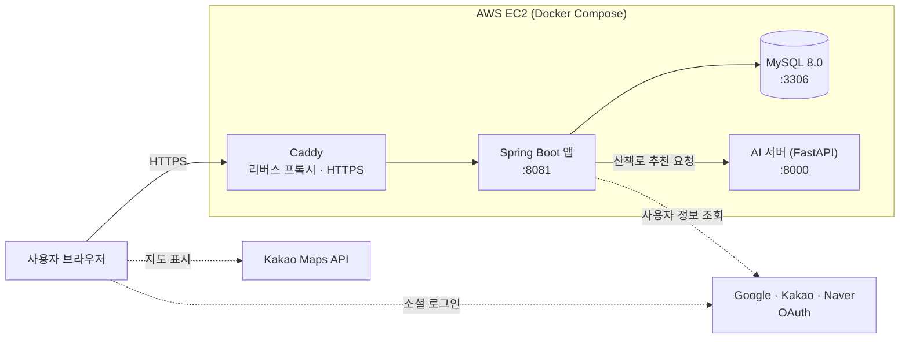
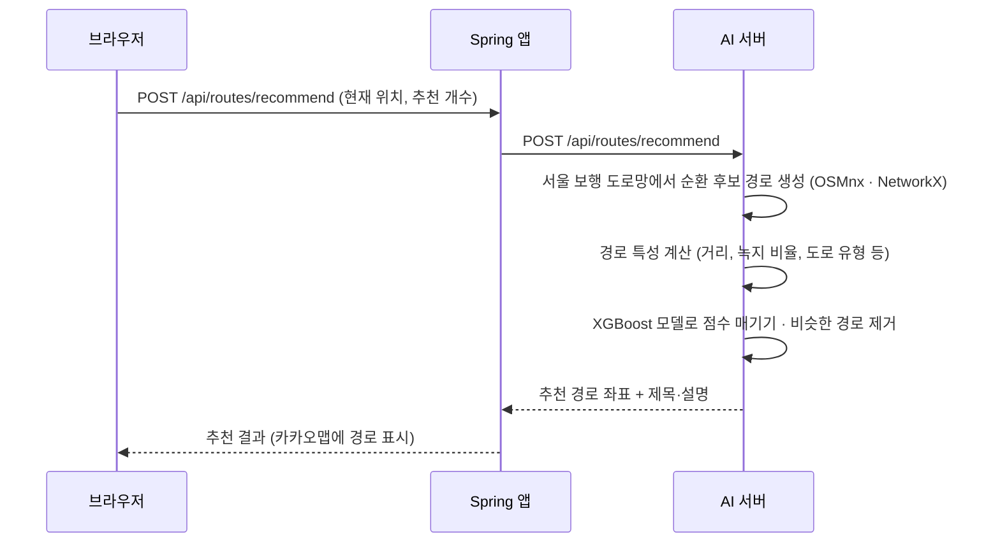

# 멍자국

반려견과 함께하는 산책을 위한 웹 서비스입니다.
현재 위치 기반 코스 추천부터 산책 기록, 동행 모집까지 제공합니다.

🌐 서비스 주소: <https://meongjaguk.cloud>

📖 설치 및 실행 방법: [Wiki](https://github.com/dydwp/meongjaguk/wiki/설치-및-실행)

## 팀 구성

| 이름 | 역할 |
| --- | --- |
| 박용제 | 팀장 |
| 정석진 | 팀원 |
| 최주영 | 팀원 |
| 김환중 | 팀원 |

## 주요 기능

- **소셜 로그인**: Google · Kakao · Naver
- **반려견 관리**: 프로필 등록·수정·삭제 및 사진 업로드
- **산책 코스 추천**: 코스 조회 및 현재 위치 기반 AI 추천
- **산책 기록**: GPS 경로 기록, 카카오맵 경로 표시, 활동 내역 확인
- **산책로 공유**: 추천 산책로 게시글 등록·수정·삭제
- **같이 걷기**: 동행 모집·참여, 신청 수락·거절, 댓글, 동행 산책 시작·종료
- **알림**: 동행 신청 등 주요 이벤트 알림

## 기술 구성

| 구분 | 기술 |
| --- | --- |
| 웹 서버 | Java 21, Spring Boot, Spring Security, Spring Data JPA, Spring Actuator |
| 화면 | Thymeleaf, JavaScript, Kakao Maps |
| 데이터베이스 | MySQL 8.0 |
| AI 서버 | Python 3.12, FastAPI, XGBoost, OSMnx, NetworkX |
| 배포·CI | Docker, Docker Compose, AWS EC2, Caddy, GitHub Actions |

## 아키텍처

### 전체 구성



- 외부에서는 Caddy(443)로만 접속할 수 있고, MySQL과 AI 서버는 서버 내부에서만 호출합니다.
- 화면은 Spring이 Thymeleaf로 만들어 내려주고, 지도와 GPS 기록은 브라우저의 JavaScript가 처리합니다.

### Spring 앱 구조

```text
Controller ──→ Service ──→ Repository ──→ MySQL
    │              │
    │              └──→ AiRouteClient ──→ AI 서버
    └── Thymeleaf 화면 / REST API(JSON)
```

| 패키지 | 역할 |
| --- | --- |
| `controller` | 화면 요청과 REST API 처리 (산책, 동행, 게시판, 마이페이지, 알림 등) |
| `service` | 핵심 비즈니스 로직, AI 서버 호출, 게시글 자동 마감 스케줄러 |
| `repository` | Spring Data JPA로 DB 접근 |
| `entity` / `dto` | DB 테이블 매핑 객체와 화면·API 전달 객체 |
| `security` / `config` | OAuth2 소셜 로그인, 접근 권한, 반려견 사진 경로 설정 |

### AI 산책로 추천 흐름



- 브라우저는 AI 서버를 직접 호출하지 않고, 항상 Spring을 거쳐 요청합니다.
- 추천 제목과 설명은 외부 LLM 없이 규칙 기반으로 만듭니다.

## CI / 배포

- **CI**: GitHub Actions로 PR과 push 때 자동으로 빌드·테스트합니다.
  - Spring 앱: [app-ci.yml](.github/workflows/app-ci.yml) — `dev`·`main` 대상 PR, `main` push (ai-server만 바뀐 경우 제외)
  - AI 서버: [ai-ci.yml](.github/workflows/ai-ci.yml) — `dev`·`main` 대상 PR과 push
- **배포**: AWS EC2 한 대에서 Docker Compose로 MySQL, Spring 앱, AI 서버, Caddy를 함께 실행합니다.
